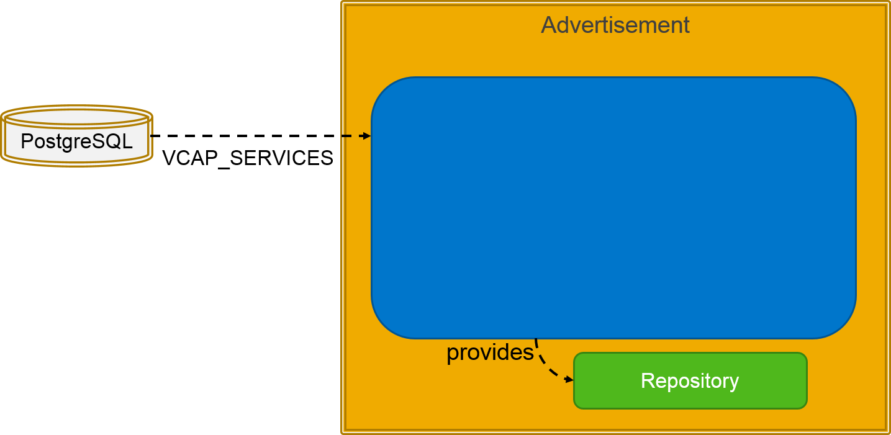
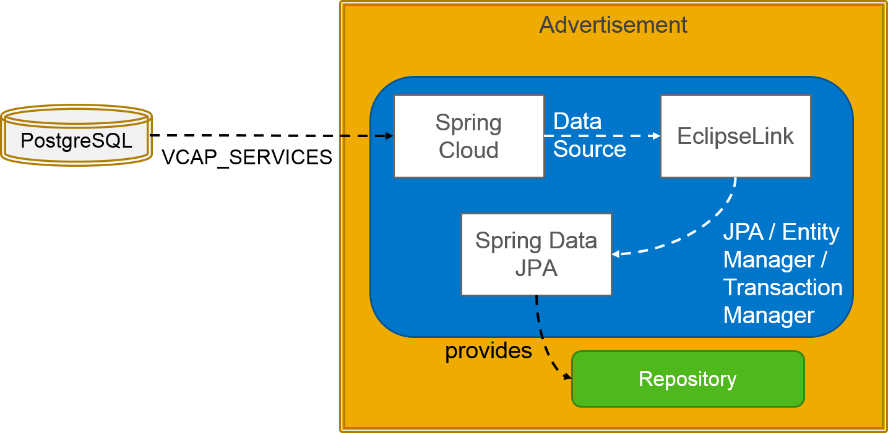

Exercise 8 (Part 1): Configure Persistence
==========================================

## Learning Goal
After this exercise you will know how to configure the persistence layer of a Spring application using Spring Data JPA. EclipseLink is used as the JPA implementation. While we want to connect to a PostgreSQL database in the cloud when running the application in production mode, the same method of configuring the database connection should be used when testing the persistence layer using a local database within your VM. 

The task of this exercise is to setup the persistence layer in such a way that it uses the PostgreSQL database connection information from the `VCAP_SERVICES` environment variables. To access our database, we make use of a convenience CRUD repository interface. This repository uses the EntityManager provided by EclipseLink.


**Used dependencies**:

In this exercise we provide the `CloudDatabaseConfig` class which sets up a CRUD repository based on the information provided in the `VCAP_SERVICES` environment variable. For this exercise it suffices to regard this class as a "black box". 




## Prerequisite
Continue with your solution of the last exercise. If this does not work, you can checkout the branch [`origin/solution-6-Deploy-Ads-On-CF`](https://github.com/SAP/cloud-bulletinboard-ads/tree/solution-6-Deploy-Ads-On-CF).

## Step 1: Add Maven dependencies
Add the following dependencies to your `pom.xml` using the XML view of Eclipse **at the end of the <dependencies> list**:

- Add spring cloud connector dependencies:
```
<!-- Spring Cloud Connector -->
<dependency>
	<groupId>org.springframework.cloud</groupId>
	<artifactId>spring-cloud-spring-service-connector</artifactId>
	<version>1.2.1.RELEASE</version>
	<exclusions>
		<exclusion>
			<groupId>org.springframework</groupId>
			<artifactId>spring-context</artifactId>
		</exclusion>
	</exclusions>
</dependency>
<dependency>
    <groupId>org.springframework.cloud</groupId>
    <artifactId>spring-cloud-cloudfoundry-connector</artifactId>
    <version>1.2.2.RELEASE</version>
    <scope>runtime</scope>
</dependency>
```
- Add `spring-data-jpa` dependency:
```
<dependency>
    <groupId>org.springframework.data</groupId>
    <artifactId>spring-data-jpa</artifactId>
    <version>1.9.2.RELEASE</version>
    <exclusions>
        <exclusion>
            <!-- We need spring-core 4.2 or later, but spring-data includes 4.1.9 -->
            <groupId>org.springframework</groupId>
            <artifactId>spring-core</artifactId>
        </exclusion>
    </exclusions>
</dependency>
```
- Add EclipseLink (JPA implementation) dependencies:
```
<!-- EclipseLink as JPA implementation -->
<dependency>
    <groupId>org.eclipse.persistence</groupId>
    <artifactId>org.eclipse.persistence.jpa</artifactId>
    <version>2.6.2</version>
</dependency>
```

- Add `postgresql` dependency:
```
<!-- PostgreSQL database implementations -->
<dependency>
    <groupId>org.postgresql</groupId>
    <artifactId>postgresql</artifactId>
    <version>9.4-1206-jdbc41</version>
    <scope>runtime</scope>
</dependency>
```

- Add `commons-dbcp2` dependency:
```
<!-- connection pooling -->
<dependency>
    <groupId>org.apache.commons</groupId>
    <artifactId>commons-dbcp2</artifactId>
    <version>2.1.1</version>
    <scope>runtime</scope>
</dependency>
```

Note: After you've changed the Maven settings, don't forget to update your Eclipse project! To do so right click on your Eclipse project and select `Maven` - `Update Project ...` (`ALT-F5`)

## Step 2: Define a simple entity
In order to use the existing `Advertisement` class as a JPA entity, you need to
- annotate the `Advertisement` class with `@Entity` and 
- specify an identifier by adding a field `id` of type `Long` (**Note** primitive type `long` does not work!), which is annotated with `@Id` and `@GeneratedValue(strategy = GenerationType.AUTO)`.
- if you decide to add a setter for the `id` field, make sure that its argument also is of type `Long` not `long`

Use the annotations in the package `javax.persistence` (corresponding to the [JPA API](https://docs.oracle.com/javaee/7/api/javax/persistence/package-summary.html)).

## Step 3: Define a Repository Using Spring Data JPA
- Create an **interface** `AdvertisementRepository` in the `com.sap.bulletinboard.ads.models` package that extends the `CrudRepository` interface. Use `Advertisement` as the entity type and `Long` as the id type.
```java
public interface AdvertisementRepository extends CrudRepository<Advertisement, Long> {

}
```
- Have a look at the methods provided by the `CrudRepository` interface. By extending `CrudRepository`, `AdvertisementRepository` inherits several methods for saving, deleting, and finding entities.
- Note: Internally Spring uses reflection to generate a proxy class, which contains the desired implementation details of the specified interface. 

## Step 4: Configure Repository

- Create a class `EntityManagerFactoryProvider` in the package `com.sap.bulletinboard.ads.util` and copy the code from [here](https://github.com/SAP/cloud-bulletinboard-ads/blob/solution-8-1-Configure-Persistence/src/main/java/com/sap/bulletinboard/ads/util/EntityManagerFactoryProvider.java).
- Create a class `CloudDatabaseConfig` in the package `com.sap.bulletinboard.ads.config` and copy the code from [here](https://github.com/SAP/cloud-bulletinboard-ads/blob/solution-8-1-Configure-Persistence/src/main/java/com/sap/bulletinboard/ads/config/CloudDatabaseConfig.java).

Some explanations to the code:  



Based on the `VCAP_SERVICES` environment variable the `spring-cloud` connector instantiates a `DataSource` instance. Note: Locally this environment variable is set so that a local PostgreSQL database named `test` is used. 

In order to persist the data using JPA, we provide (EclipseLink) implementations of `EntityManager` and `TransactionManager` using a logical database connection, which is represented by the [`Data Source`](http://docs.oracle.com/javase/8/docs/api/javax/sql/DataSource.html). 

Finally the CRUD repository, which uses the `EntityManager` and `TransactionManager`, is instantiated by using the `@EnableJpaRepositories` annotation.


## Step 5: Build and Run Microservice Locally
- In Eclipse, in the "Servers" view, open the Tomcat server. In the opened detail view (`Overview` tab), click on "Open launch configuration". Change to the "Environment" tab, and inspect the `VCAP_SERVICES` environment variable. You should see that this allows your application to connect to a local database.
- Build and run the microservice.
- Ensure that the `advertisement` table is created with columns `id` and `title`. You can use the `DBeaver` Eclipse Perspective, where the table should be visible within the `Database Navigator` view under `Schemas - public - Tables`.
- Also note that a `sequence` table is created. This table is used by EclipseLink to determine which (unused) ID should be used for a created entity.

**Notes:**
 - When running the service in the terminal ensure that you've executed `localEnvironmentSetup.sh` [as explained here](/CreateMicroservice/Exercise_1_GettingStarted.md).
 - If you want to run the `tomcat7:run` Maven goal in Eclipse, you need to configure the environment variables (in the corresponding run configuration) starting with this exercise. Please have a look at the `localEnvironmentSetup.sh` file for this. Alternatively, use the Tomcat server in Eclipse (without Maven), or run Maven in the console.
 - Note, that the data is still read from / written into the HashMap. We will change that in the second part of the exercise.

## [Optional] Step 6: Specify the Table / Field Names Using JPA Annotations
- Annotate the `Advertisement` class with `@Table(name = "advertisements")` to specify the name of the database table.
- Annotate the `title` field with `@Column(name = "mytitle")` to specify the name of the column. Note that names starting with an underscore might be reserved, and actually cause problems in HSQLDB.
- Build and run the microservice. 
- Ensure that the `advertisements` table is created with columns `id` and `mytitle`. You can use the `DBeaver` Eclipse Perspective, where the table should be visible within the `Database Navigator` view under `Schemas - public - Tables`. You probably need to do a refresh to visualize them. If the new table is still not shown, you need to `stop`, `clean...` and `restart` your Tomcat server.
- Take a look at the annotations offered by [JPA API](https://docs.oracle.com/javaee/7/api/javax/persistence/package-summary.html).

## Used Frameworks and Tools
- [Spring Cloud: How to configure Service Connections for Spring](https://docs.cloudfoundry.org/buildpacks/java/configuring-service-connections/spring-service-bindings.html)
- [Java Persistence API (JPA) tutorial](http://docs.oracle.com/javaee/6/tutorial/doc/bnbpz.html) 
- [Spring Data JPA](http://projects.spring.io/spring-data-jpa/)
- [EclipseLink Object/Relational Mapping](http://www.eclipse.org/eclipselink/)
- [Chrome JSON Editor](https://chrome.google.com/webstore/detail/json-editor/lhkmoheomjbkfloacpgllgjcamhihfaj) to view / edit the `VCAP_SERVICES` variable 

## Further Reading
- [JDoc PersistenceUnitProperties](https://eclipse.org/eclipselink/api/2.0/org/eclipse/persistence/config/PersistenceUnitProperties.html)
- [Spring Data JPA - Reference Documentation](http://docs.spring.io/spring-data/jpa/docs/1.8.0.M1/reference/html/#repositories.query-methods.query-creation)


***
<dl>
  <dd>
  <div class="footer">&copy; 2018 SAP SE</div>
  </dd>
</dl>
<hr>
<a href="/ConnectDatabase/Exercise_7_ConnectLocalDatabase.md">
  
</a>
<a href="/ConnectDatabase/Exercise_8_Part2_UseRepositoryToAccessDatabase.md">
  
</a>
