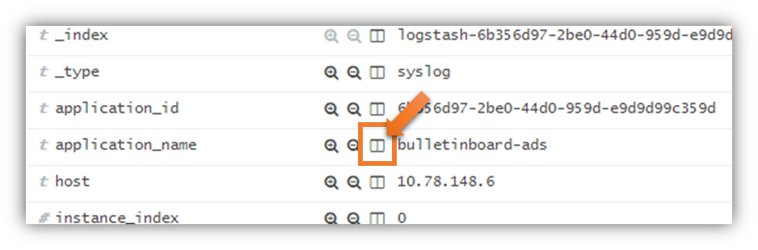

Exercise 14: Getting Started with Elastic Stack
=====================================

## Learning Goal
The task of this exercise is to get familiar with the log output of the Cloud Foundry environment and learn how you can analyze logs in `Kibana` as part of the provided Elastic Stack.

## Prerequisite
Continue with your solution of the last exercise. If this does not work, you can checkout the branch [`origin/solution-13-Use_SLF4J_Features`](https://github.com/SAP/cloud-bulletinboard-ads/tree/solution-13-Use-SLF4J-Features).

Ensure that you've provided a PostgreSQL service with name `postgres-bulletinboard-ads` on the Cloud Foundry environment [as explained in Exercise 10](/ConnectDatabase/Exercise_10_DeployAdsWithDBServiceOnCF.md).


## Step 1.1: Create Logging Service
Create a service instance with name `application-logs`. 

```
cf create-service application-logs lite applogs-bulletinboard
```

**Note:** You can get the exact names of the available services and its plans in the Service Marketplace (`cf marketplace`). Furthermore note that the created backing service is only *available* within the current targeted space and can be bound only to the applications within the same space.
th
## Step 1.2: Update `manifest.yml`
Make sure you specify the service entry in context of your application configuration, i.e. place it with the correct indentation.

```
---
applications:
- name: bulletinboard-ads
  ...
  services:
  - applogs-bulletinboard
```


## Step 1.3: Push Your Service and Create Some Log Messages

For this exercise you need to deploy the application once more:
- perform a `mvn clean verify` and push the bulletinboard-ads microservice to your trial space (`cf push –n bulletinboard-ads-<<your user id>>`). 

Create some log messages on the Cloud Foundry environment via `Postman` by sending
- a single GET-request for an advertisement that **doesn't exist** and
- a single GET-request for an advertisement that **exists**

## [Optional] Step 2: Inspect Log Output of the Cloud Foundry Environment
Before analyzing logs with `Kibana`, let's have a look at the log output. Enter 
```
cf logs bulletinboard-ads --recent
```
to analyze the buffered logs. Be aware that the size of the buffer is restricted.

With `cf logs bulletinboard-ads` you can stream the current log output to the command line. Do not stop the command inside the terminal and with `Postman` perform a single GET request for an advertisement that doesn't exist. Please expect some delay until the log messages appear in the command line. Press `Ctrl+C` in your command line to stop streaming the log output.


## Step 3: Login to `Kibana`
Finally we want to analyze the logs generated by (your) application in `Kibana`.

- Go to `Kibana`: For Europe (Frankfurt) use [https://logs.cf.eu10.hana.ondemand.com/](https://logs.cf.eu10.hana.ondemand.com/) and for US East (VA) use [https://logs.cf.us10.hana.ondemand.com/](https://logs.cf.us10.hana.ondemand.com/) and login with your SAP Cloud Platform user, i.e. your email address and password.
- The landing page of `Kibana` is the `Dashboard` page providing some other dashboards like Usage, Performance, Network load and others. 
- At the top right you can adapt the timelines to your need and enable "Auto-refresh". The default is that log messages of the last 15 minutes are shown.
- On the `Visualize` page you may create and share your own dashboards. Creating dashboards is not part of this exercise.

## Step 4: Search for Messages From Your Component
The `Overview`-`Dashboard` page shows your organizations and spaces in the Cloud Foundry environment, and also all applications (in the "Components" view).
You can limit the shown log messages by clicking on the corresponding org/space/application.

For this exercise step, limit the logs to the "bulletinboard-ads" application. You may also limit to the "trial" organization and your `<<your user id>>` space.
Notice that the selected values appear as green filters on the top, below the search field.

To see the actual log messages, you have to navigate to the `Requests and Logs`-`Dashboard` page (in the "Navigation" view).

Be aware that the filter settings are lost when you switch the page.

**Workaround:** Go to the `Overview`-`Dashboard` page and re-apply the filters by selecting your application.
Then, hover the mouse pointer over each filter and pin it down by clicking on the pin icon. __Pinned filters__ will stay active even when you switch pages.


## Step 5: Organize the Columns in the Application Logs View
Again, navigate to the `Requests and Logs`-`Dashboard` view and examine the log messages in the "Requests" and "Application Logs" views. The "Application Logs" view by default shows some columns like the component_name, correlation_id, level, msg,	logger.

To add more columns to the view, expand the first **application log message of your `AdvertisementController` logger** by clicking on the arrow on the left side of the log. In the table view scroll down, find the `endpoint` parameter (which you set in the MDC as part of exercise 13) and click on the symbol you can see in the screenshot below:



Then, collapse the log list entry you have expanded. Now you can see that the endpoint is displayed as an additional column.

You can remove columns from the overview list either by again clicking the symbol shown in the screenshot above. Alternative approach: mouse over the headline of a column to be removed and click on the "x" (mouse-over-text: Remove column).

## Step 6: Add and Remove Filters
In `Kibana` you can define positive and negative filters for messages.
We already added (positive) filters by selecting entries in the dashboard, which suffices for the basic scenarios.

If a positive filter is used, only messages matching the filter are shown. For example, you can define a positive filter so that only log messages for a specific Java class are shown.

- Find and expand an application log entry that contains the `endpoint` information. Scroll down to the parameter `endpoint` and click on the magnifier symbol with the plus symbol inside. When collapsing the entry you should see only log entries matching the filter, which appears with a *green background* directly under the search field.
- To remove a set filter, mouse over to the filter which is displayed directly under the search field and click on the garbage can symbol.

Messages matching a negative filter are not shown. This can be used to remove certain messages from the output, for example you can define a negative filter removing with log level `INFO` (so that you can better concentrate on warnings and errors).

- Choose a log entry where the value of the parameter `level` is `INFO`. Scroll down to the parameter `level` and click on the magnifier symbol with the minus symbol inside. Now all log entries with log level `INFO` should be filtered out and you should see this filter with a *red background* directly under the search field.
- To remove a set filter, mouse over to the filter which is displayed directly under the search field and click on the garbage can symbol. Perform this for the filter you just have set (`level: "info"`).

**Note:** If you add another / new field, you need to wait up to 60 minutes, till it is available/visible in `Kibana`, as a cronjob updates the indices once per hour.


### Optional Ideas
- Create at least two instances of your app (`cf scale -i 2 bulletinboard-ads`). Then perform a few get requests and have a look at the `source_instance` field in `Kibana`.
- Explore the other pages of the dashboard and filter based on response times, HTTP status codes, ...
- For the "raw" experience, play around in the "discover" view. Notice that all different kinds of logs (check the `layer` column) are shown here. For example `layer`=`RTR` are CF Router specific logs, `STG` logs are emitted when an application is `(re-)staged`. Find further log types [here](https://docs.cloudfoundry.org/devguide/deploy-apps/streaming-logs.html). Find out which `layer` your application specific log message is assigned to.

## Used Frameworks and Tools
- [Kibana documentation](https://www.elastic.co/products/kibana)
- [CloudFoundry Loggregator](https://github.com/cloudfoundry/Loggregator)
- [Logging Library](https://github.com/SAP/cf-java-logging-support)

## Further Reading
[How to change the log-level for a single thread by providing a token in the request header](https://github.com/SAP/cf-java-logging-support/wiki/Dynamic-Log-Levels)


***
<dl>
  <dd>
  <div class="footer">&copy; 2018 SAP SE</div>
  </dd>
</dl>
<hr>
<a href="/LoggingTracing/Exercise_13_Use_SLF4J_Features.md">
  
</a>
<a href="/Service2ServiceCommunication/Exercise_16_Call_UserService.md">
  
</a>
